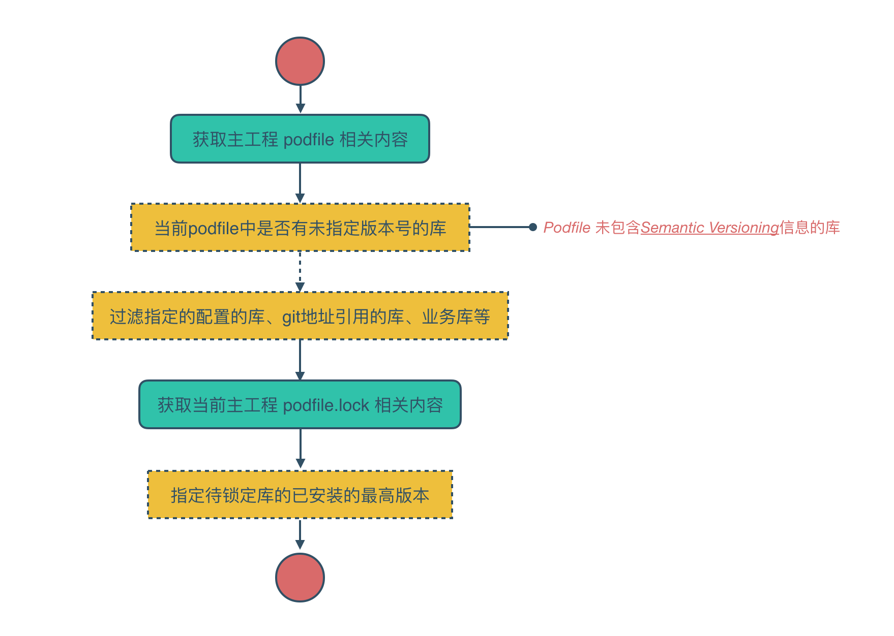

# podfile - podfile版本控制流程

直接在命令行执行  `big podfile --help` 可以查看其提供的所有功能

```
NAME
    podfile - Podfile operation

SYNOPSIS
    big [global options] podfile [command options] detect
    big [global options] podfile [command options] lock
    big [global options] podfile [command options] upgrade

COMMAND OPTIONS
    --pod, --podfile=arg - (default: none)

COMMANDS
    detect  - Detect podname should be locked.
    lock    - Lock podname should be locked.
    upgrade - Update module version

```

全局参数如下：

- -pod  --podfile ：podfile文件路径

功能列表如下：

- detect：
    检测当前同步到本地的项目工程中podfile，得到未锁定的第三方库。
    如果存在，提示需要指定版本。
    如果不存在，提示无需指定版本的第三方库。

- lock:
    检测到存在需指定代版本的三方库后，执行lock指令对所有需要锁定的库进行锁定。

- upgrade:
    检测配置文件中指定业务库，有无最新可更新版本。

  ## podfile lock 流程

    
