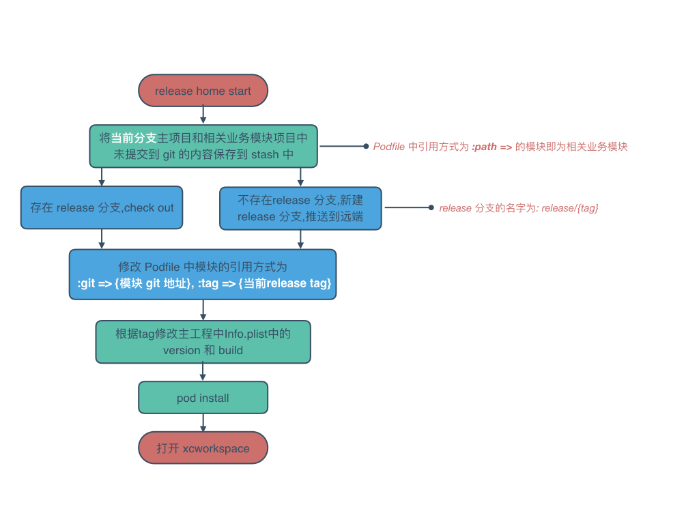
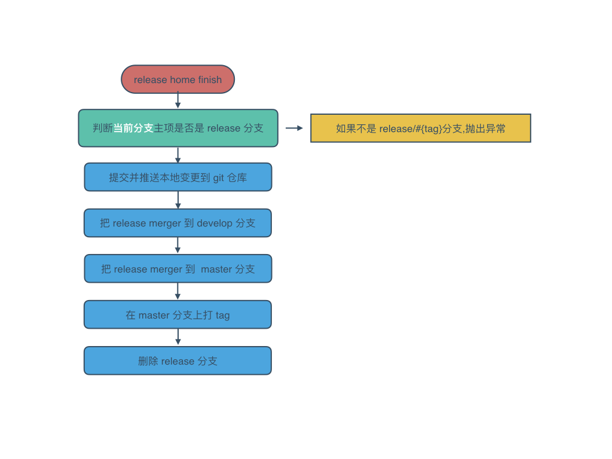
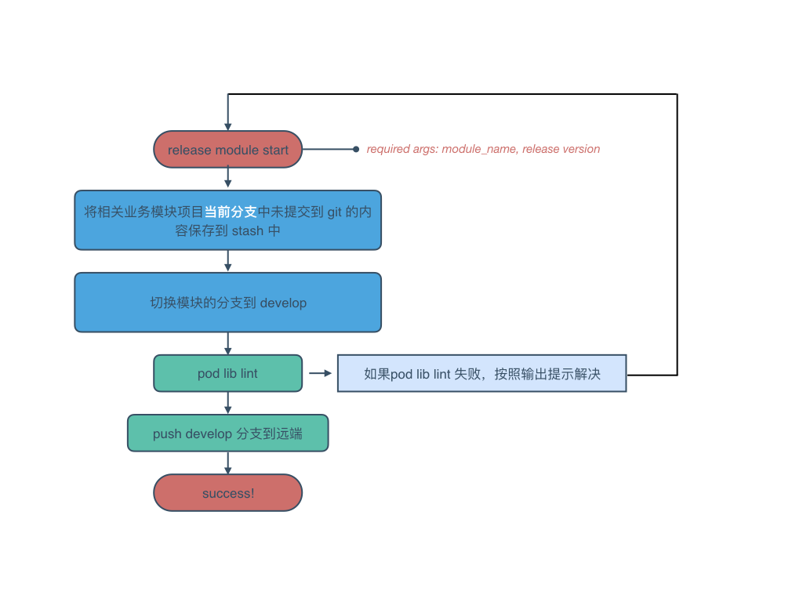
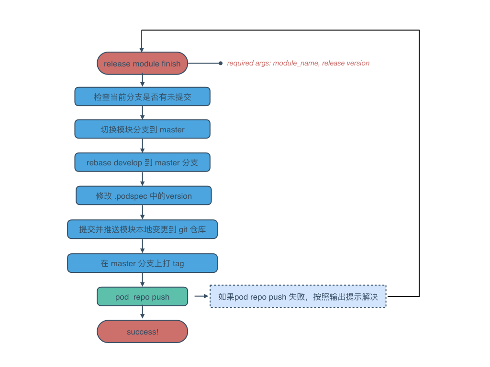

# release - 功能开发流程

直接在命令行执行 `big release --help` 可以查看其提供的所有功能：
```
NAME
    release - Release operations

SYNOPSIS
    big [global options] release home
    big [global options] release module

COMMANDS
    home   - Release home project operations
    module - Start release module
```
全局参数如下：

- -u, --user：用户名，默认是 git global config 的 user.name，会显示在命令提示信息中，比如上述提示信息中的默认用户名是 mmoaay

- -p, --path：项目路径名，默认是当前所在的路径

- -v, --version：项目版本号，默认是当前所在的路径

功能列表如下：

- home: 发布主工程命令
    - start: 开始发布主工程的某个版本
    - finish: 完成发布版本
- module: 发布模块命令
    - start: 开始发布模块的某个版本
    - finish: 完成发布版本

## release 的工作区
  同 feature 工作区

## release home start 流程

## release home finish 流程

## release module  start 流程

## release module  finish 流程

